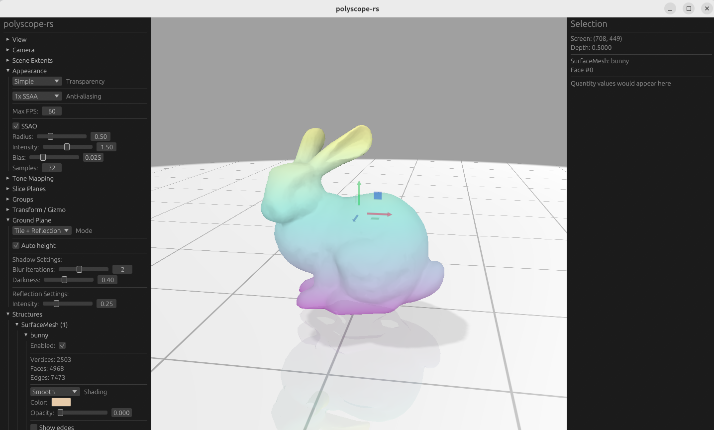

# polyscope-rs



A Rust-native 3D visualization library for geometric data, inspired by [Polyscope](https://polyscope.run).

[](https://opensource.org/licenses/MIT)

## Overview

polyscope-rs is a viewer and user interface for 3D data such as meshes and point clouds. It allows you to register your data and quickly generate informative visualizations, either programmatically or via a dynamic GUI.

This is a Rust reimplementation of the original C++ [Polyscope](https://github.com/nmwsharp/polyscope) library, using modern Rust graphics libraries (wgpu, winit, egui).

## Disclaimer

This project is an experiment in **AI-driven software development**. I have limited Rust experience but have used [Polyscope](https://polyscope.run) extensively and contributed PRs to the original C++ library. It validates the hypothesis that languages with **informative compiler feedback** (like Rust) work better with AI-assisted development.

**Note:** This project is in an **early phase** and requires more testing. **Use at your own risk.** Contributions and feedback are welcome in the [Discussions](https://github.com/xarthurx/polyscope-rs/discussions) section.

## Project Status

**Current Version:** 0.2.0 (Alpha)

**Feature Parity:** ~95% of C++ Polyscope 2.x

### What's Working

| Feature | Status |
|---------|--------|
| Point Clouds | ✅ Full support |
| Surface Meshes | ✅ Triangle meshes with full quantity support |
| Curve Networks | ✅ Full support |
| Volume Meshes | ✅ Tet/Hex cells |
| Volume Grids | ✅ Basic support |
| Camera Views | ✅ Full support |
| Materials | ✅ 8 matcap materials (per-structure) |
| Color Maps | ✅ 10+ maps |
| Ground Plane | ✅ Tile/Shadow/Reflection |
| Slice Planes | ✅ Up to 4 planes |
| Groups | ✅ Hierarchical |
| Gizmos | ✅ Translate/Rotate/Scale |
| Transparency | ✅ Weighted Blended OIT |
| Tone Mapping | ✅ HDR pipeline |
| SSAO | ✅ Ambient occlusion |
| Screenshots | ✅ PNG/JPEG export |
| Picking | ✅ Structure/Element |
| Parameterization | ✅ Checker/Grid/Local styles |
| Intrinsic Vectors | ✅ Tangent-space with symmetry |
| One-Forms | ✅ Edge-based differential forms |
| Floating Quantities | ✅ Scalar/Color/Render images |

### What's Not Yet Implemented

- Full polygon mesh support (arbitrary polygons)
- Color RGBA support (currently RGB only)

See [docs/architecture-differences.md](docs/architecture-differences.md) for a detailed comparison with C++ Polyscope.

## Features

- **Point Clouds** - Visualize point sets with scalar, vector, and color quantities
- **Surface Meshes** - Render triangular meshes with scalars, vectors, colors, parameterization, intrinsic vectors, and one-forms
- **Curve Networks** - Display networks of curves and edges
- **Volume Meshes** - Visualize tetrahedral and hexahedral meshes
- **Volume Grids** - Render implicit surfaces via marching cubes
- **Camera Views** - Visualize camera frustums and poses
- **Slice Planes** - Cut through geometry to see interiors
- **Groups** - Organize structures hierarchically
- **Gizmos** - Interactive transform manipulation

## Quick Start

```rust
use polyscope::*;

fn main() -> Result<()> {
    // Initialize polyscope
    init()?;

    // Register a point cloud
    let points = vec![
        Vec3::new(0.0, 0.0, 0.0),
        Vec3::new(1.0, 0.0, 0.0),
        Vec3::new(0.0, 1.0, 0.0),
    ];
    let pc = register_point_cloud("my points", points);

    // Add a scalar quantity
    pc.add_scalar_quantity("height", vec![0.0, 0.5, 1.0]);

    // Show the viewer
    show();

    Ok(())
}
```

## Installation

Add to your `Cargo.toml`:

```toml
[dependencies]
polyscope = "0.2"
```

## Architecture

polyscope-rs uses a paradigm of **structures** and **quantities**:

- A **structure** is a geometric object in the scene (point cloud, mesh, etc.)
- A **quantity** is data associated with a structure (scalar field, vector field, colors)

For a detailed comparison of the architecture and API differences between polyscope-rs and C++ Polyscope, see [docs/architecture-differences.md](docs/architecture-differences.md).

## Crate Structure

- `polyscope` - Main crate with public API
- `polyscope-core` - Core traits and state management
- `polyscope-render` - wgpu rendering backend
- `polyscope-ui` - egui UI integration
- `polyscope-structures` - Structure implementations

## Technology Stack

| Component | Library | C++ Polyscope Equivalent |
|-----------|---------|-------------------------|
| Rendering | [wgpu](https://wgpu.rs) | OpenGL |
| UI | [egui](https://github.com/emilk/egui) | Dear ImGui (C++) |
| Math | [glam](https://github.com/bitshifter/glam-rs) | GLM |
| Windowing | [winit](https://github.com/rust-windowing/winit) | GLFW |
| Shaders | WGSL | GLSL |
| Build | Cargo | CMake |

## Comparison with C++ Polyscope

For developers familiar with the C++ version or considering migration, see:

- [docs/architecture-differences.md](docs/architecture-differences.md) - Detailed feature comparison and API differences

### Key Differences

1. **Graphics Backend**: Uses wgpu instead of OpenGL, providing native support for Vulkan, Metal, DirectX 12, and WebGPU
2. **Error Handling**: Uses Rust's `Result<T, E>` instead of exceptions
3. **Memory Safety**: Leverages Rust's ownership model for memory safety
4. **API Style**: Uses handles and closure-based access instead of raw pointers

## Platform Support

| Platform | Status |
|----------|--------|
| Linux (X11/Wayland) | ✅ Tested |
| Windows | ✅ Tested |
| macOS | ✅ Should work |
| WebGPU | 🔄 Planned |

## Known Issues

- **Intermittent SIGSEGV on WSL2**: When running under Windows Subsystem for Linux 2 with GPU passthrough, the application may occasionally crash with exit code 139 (SIGSEGV) inside the GPU driver. This is a known class of WSL2/GPU driver instability issues, not a bug in polyscope-rs. Native Linux, Windows, and macOS are unaffected.
- **wgpu late binding validation workaround**: All uniform buffer bindings use explicit `min_binding_size` to work around [wgpu#7359](https://github.com/gfx-rs/wgpu/issues/7359), where late buffer binding size validation cross-contaminates between pipelines in the same command encoder. This is transparent to users but relevant for contributors adding new pipelines or bind group layouts.

## License

MIT License - see [LICENSE](LICENSE) for details.

## Acknowledgments

This project is inspired by the original [Polyscope](https://github.com/nmwsharp/polyscope) C++ library by [Nicholas Sharp](https://nmwsharp.com).

## Contributing

Contributions are welcome! Key areas where help is needed:

- Full polygon mesh support (arbitrary polygons)
- Color RGBA support
- Documentation and examples
- Testing on different platforms (macOS, WebGPU)
